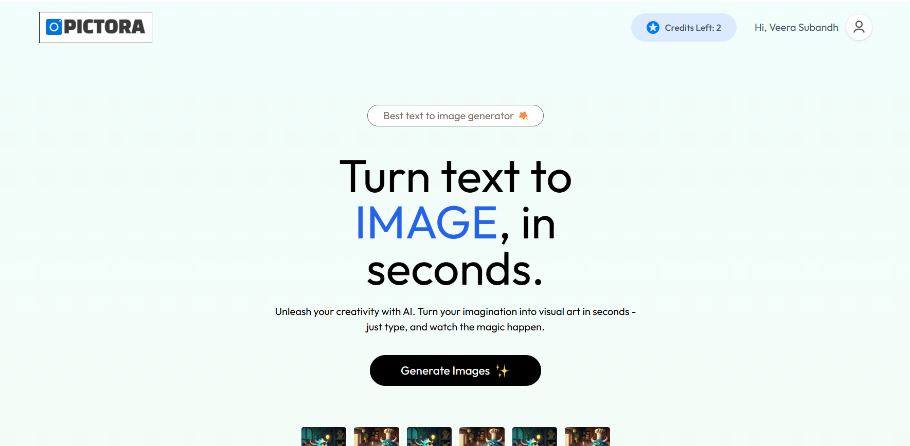
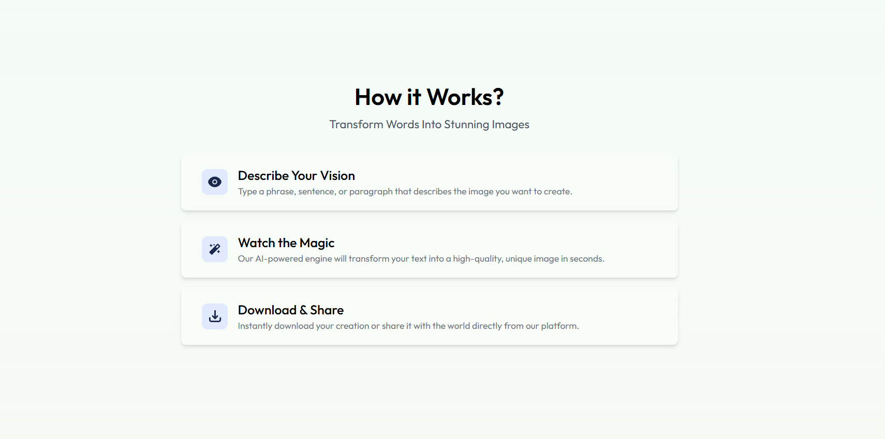
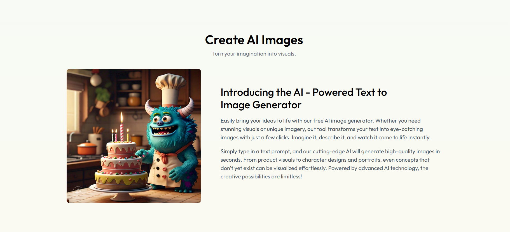
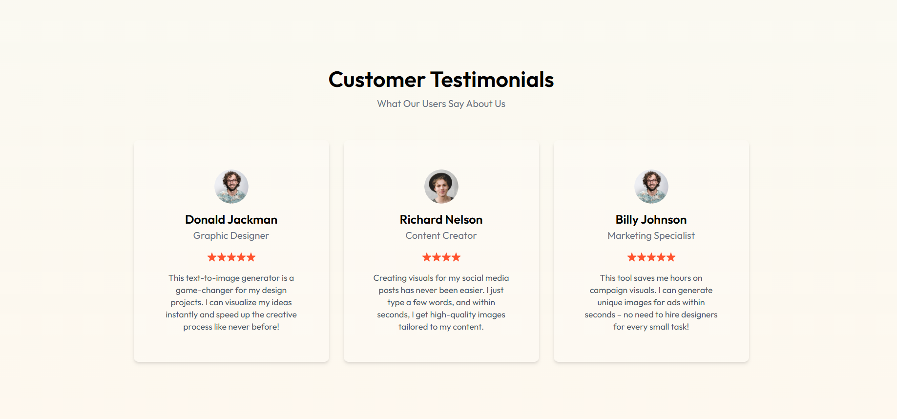
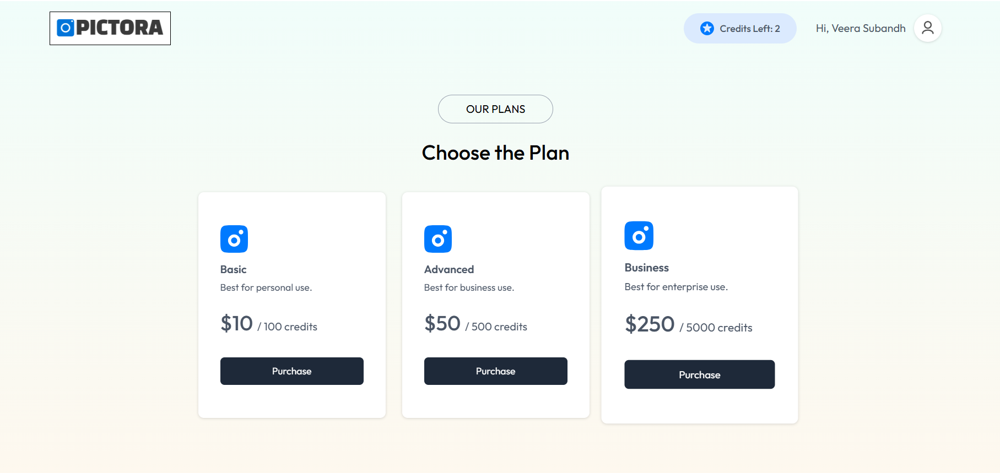
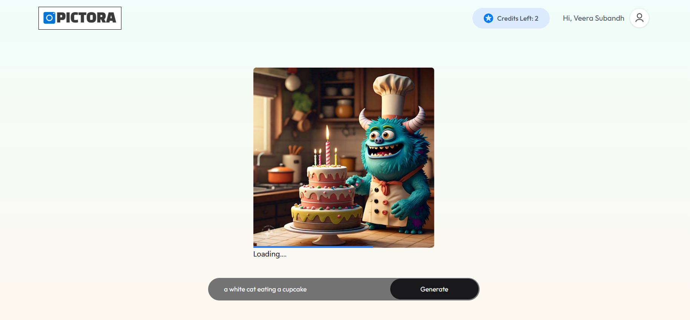
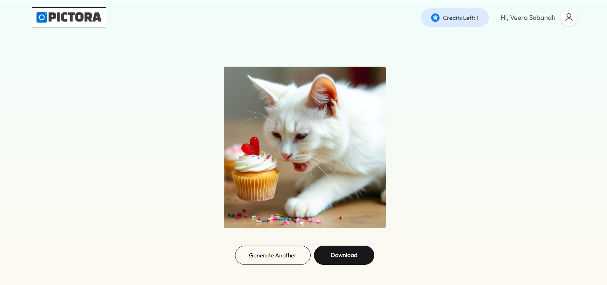

## Full Stack AI SaaS Text-to-Image Generator

Developed a Full Stack AI-powered SaaS Application using MERN Stack (MongoDB, Express, React, Node.js) to build a Text-to-Image Generator leveraging Clipdrop API for AI-generated images.

- Implemented a Credit-Based System allowing users to generate images based on credits and integrated an online payment gateway (Razorpay) for purchasing additional credits.
- Built Secure User Authentication with JWT and MongoDB to handle user registration, login, and account management, ensuring data persistence and security.
- Integrated RESTful APIs to handle image generation, credit management, and payment verification, enabling seamless front-end and back-end communication.

## Screenshots

### Homepage

### Payment Page

### Generated Images

